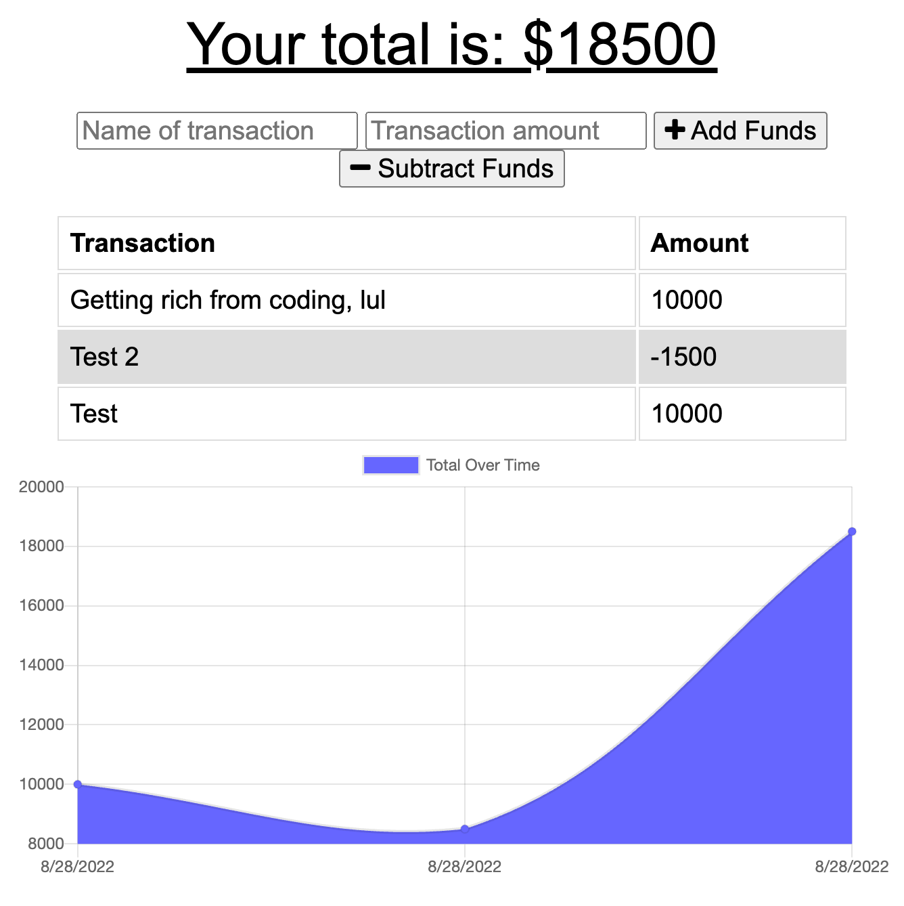

# Budget Tracker

## Purpose

A progressive web application offering a simple easy to use budget tracker that can be used offline if neccesary.

## Built with

HTML, CSS, Javascript, NODEjs, Express, MongoDB, Mongoose, Morgan, Compression

## Website

https://mighty-brushlands-72050.herokuapp.com/

## Usage

Website will notify users of a transaction via the console log.

## Contribution

Made with ❤️ by Phil Gelin
